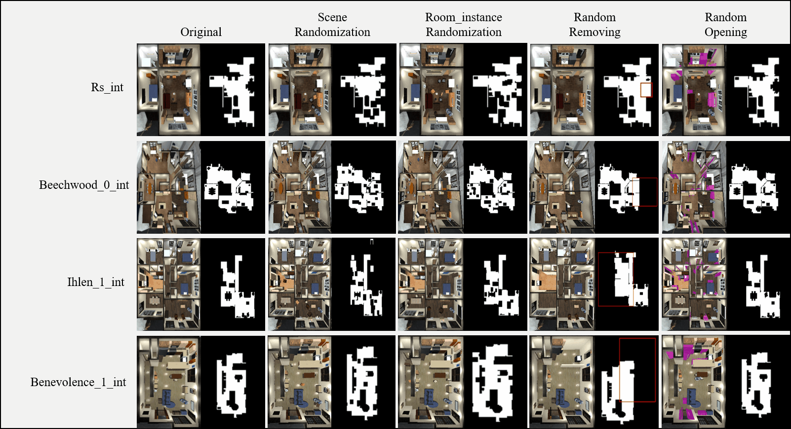

# Scene-Augmentation-Methods-for-Interactive-Embodied-AI-Tasks
Code and additional information for our paper entitled 'Scene Augmentation Methods for Interactive Embodied AI Tasks'

The emerging embodied AI paradigm enables intelligent robots to learn like humans from interaction, and is thus considered an effective way approach to general artificial intelligence. Unfortunately, even the best performing agents still overfit and generalize poorly to unseen scenes, due to the limited scenes provided by embodied AI simulators. To alleviate this issue, we propose a scene augmentation strategy to scale up the scene diversity for interactive tasks and make the interactions more like the real world. Inspired by data augmentation in CV and NLP, we propose a scene augmentation  strategy for interactive embodied AI simulators. SA aims to change the environment states randomly to improve the diversity of the training scenes required by different tasks, thus, alleviating overfitting and helping agents generalize to unseen scenes. Meanwhile, our strategy can provide the distributions of the real cluttered environment for agent learning from interaction, which is important for current high-fidelity simulation platforms to minimize the gaps between real and virtual and toward the metaverse.

Specifically, we've built out a number of scene augmentation methods which allow for changing the state distribution of the environment, including:
* Scene Randomization: randomly rearranging scene objects in the entire scene area, 
* Room-instance Randomization: randomly rearranging scene objects in the original room instance,
* Random Removing: randomly removing objects in a rectangle region of scene, 
* Random Opening: randomly changing the opening status of articulated objects.

Examples in iGibson are shown as below:

## Necessary Imports and other Logistics

To run the demo notebook and to use some of the libraries, the following packages are necessary:

* iGibson2.2.0
* opencv
* python3.8
and other requirements for iGibson

## Quickstart guide

To run test these methods, one can simply run the example file with **python example.py** ; 

The **configs/augmentation.yaml** file is for configuring the augmentation method.

## Todo

* Add more detailed information.

